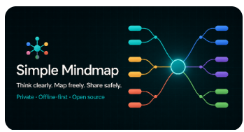

<p align="center">
  <a href="https://thundom.github.io/simplemindmap/launch.html">
    
  </a>
</p>

<h1 align="center">Simple Mindmap</h1>

<p align="center"><strong>Think clearly. Map freely. Share safely.</strong></p>

<p align="center">
  A private, offline-first mind map editor for serious knowledge work.<br>
  One HTML file. No account. No backend. Your information stays under your control.
</p>

<p align="center">
  <a href="https://thundom.github.io/simplemindmap/"><strong>Open the web app</strong></a>
  · <a href="https://thundom.github.io/simplemindmap/launch.html">Product overview</a>
  · <a href="../../releases/latest">Download</a>
  · <a href="CHANGELOG.md">Version history</a>
</p>

<p align="center">
  <a href="LICENSE"></a>
  <a href="../../releases/latest"></a>
  
  
</p>

## A calmer way to structure complex information

Simple Mindmap combines the freedom of a visual canvas with the discipline of a hierarchy. It is designed for information that needs to be understood, reorganised and shared—not trapped inside another cloud platform.

| Private by default | Portable by design | Built for real restructuring |
| --- | --- | --- |
| Browser maps stay in local storage. The app has no account system, analytics service or silent data upload. | Run it online, open one standalone HTML file, or use the Windows installer or portable application. | Move any node, change its parent, reorder siblings, or promote a branch to either side of the centre. |

## What makes it different

- **A true two-sided canvas** — arrange primary branches on the left and right of the centre for radial, snowflake-like maps.
- **Direct manipulation** — drag nodes at any depth to change their parent, order or branch direction.
- **Natural canvas navigation** — pan by dragging blank space, zoom around the pointer, fit the full map, centre the selected node and navigate with the keyboard.
- **Persistent multi-map tabs** — keep several maps open, restore them after reload and double-click tab names to create memorable workspace labels.
- **Undo you can see** — every edit, move, colour change, collapse and delete is added to session history; restore with the History panel or `Ctrl+Z`.
- **Interactive read-only sharing** — export a self-contained HTML snapshot that viewers can pan, zoom, search, expand, collapse and print without editing the source.
- **Open, practical formats** — import Markdown, export Markdown, create JSON backups and generate print-ready PDF documents.
- **No installation required** — the browser application is contained in `index.html` and has no runtime dependency.

## Built for knowledge that matters

Simple Mindmap works especially well for:

- HRIS architecture, supervisory organisations and workforce data models
- policy, compliance and control libraries
- operating models, process taxonomies and service catalogues
- research synthesis and literature structures
- product discovery, project planning and decision maps
- any large hierarchy that needs frequent reorganisation

### Included English HRIS operating model

Select **Load sample** to explore a 170-node HRIS model covering:

- employee master data and identity
- supervisory organisations and company structures
- employment lifecycle events
- time, absence, compensation and benefits
- security, privacy, audit and data quality
- integrations, reporting and data governance

The sample is entirely English and deliberately uses branches on both sides of the centre node. Version 1.7 also migrates the untouched 95-node legacy EBA sample stored by earlier versions, so upgraded web, Windows and standalone HTML editions open the current English example.

## Choose the edition that fits your environment

| Edition | Best for | Storage |
| --- | --- | --- |
| [Web app](https://thundom.github.io/simplemindmap/) | Immediate access in a modern browser | Browser `localStorage` |
| Standalone HTML application | Restricted computers where `.exe` files cannot run | Browser storage beside a portable single-file app |
| Windows installer | Regular desktop use with a chosen map folder | Individual JSON files in the selected folder |
| Windows portable | Use without installation | Individual JSON files in the selected folder |
| Read-only HTML export | Sending an interactive snapshot to someone else | The map is embedded inside the exported file |

All downloadable editions are available from [GitHub Releases](../../releases/latest).

## Start in seconds

### Browser

Open <https://thundom.github.io/simplemindmap/>. No registration or sign-in is required.

### Single-file application

Download `Simple.Mindmap-x.x.x.html` from [Releases](../../releases/latest), save it anywhere and double-click it.

### Windows

- `Simple Mindmap-Setup-x.x.x.exe` — installer with a selectable installation directory
- `Simple Mindmap-Portable-x.x.x.exe` — portable version that runs without installation

## Core controls

| Action | Control |
| --- | --- |
| Edit a node | Double-click |
| Add a child | `Tab` |
| Add a sibling | `Enter` |
| Delete a node | `Delete` |
| Undo | `Ctrl+Z` |
| Pan | Drag blank canvas, Space-drag or middle-drag |
| Zoom | Toolbar, `Ctrl`+wheel, `+` or `-` |
| Fit map | `F` |
| Centre selected node | `C` |
| Reset view | `0` |

## Sharing without surrendering control

The Share panel offers two locked formats:

1. **Read-only link** — encodes a compressed map snapshot in the URL for browser viewing.
2. **Standalone read-only HTML** — downloads one interactive offline file containing the map and viewer.

Recipients can explore, expand, collapse and print the snapshot, but editing, saving and adding the map to their library remain disabled. Sharing creates a copy; it never exposes the editable source map.

## Privacy and backup

- There is no Simple Mindmap server or user database.
- Browser maps remain in that browser profile and do not automatically follow you to another device.
- Clearing browser data can remove browser-stored maps, so use **Backup** for important work.
- The Windows edition stores map files locally in the folder you select.
- Read-only links contain the shared snapshot in the URL; treat the link like the document itself.

## Data formats

Markdown import and export use a heading followed by nested list items:

```markdown
# Mind Map Title

- First branch
  - Child node
    - Grandchild node
- Another branch
```

Markdown stores content and hierarchy. Use JSON backup when you also need colours, collapsed states and other presentation metadata.

## Local development

```bash
npm install
npm start        # Run the Electron desktop application
npm test         # Validate all locales and the English HRIS sample
npm run dist     # Build the Windows installer and portable application
```

Do not want to install Node.js? Open `index.html` directly—the complete browser application lives in that single file.

Pushing a `v*` tag automatically builds the Windows installer, portable application and standalone HTML application through GitHub Actions.

## Localisation

The interface supports English, Chinese and Japanese. Interface translations live together in the `I18N` dictionary in `index.html`; the built-in map content remains English in every interface language.

## Project links

- [Product launch page](launch.html)
- [LinkedIn launch copy](LINKEDIN-LAUNCH.md)
- [Version history](CHANGELOG.md)
- [MIT License](LICENSE)

## License

Simple Mindmap is released under the [MIT License](LICENSE). Use it, adapt it and build with it while retaining the license notice.
